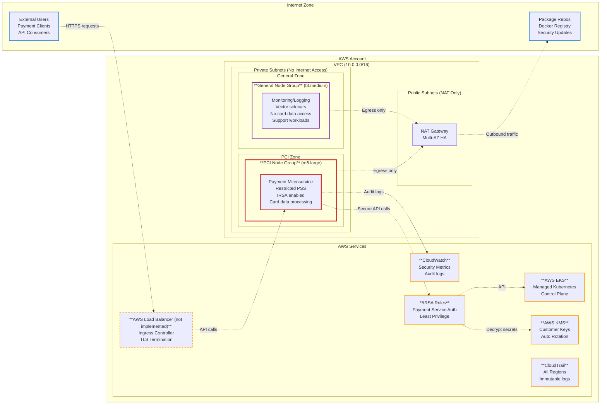

# PCI DSS Platform - Day 1 Infrastructure

## Secure, PCI-Aware AWS + Kubernetes Platform for Payment Microservices

This project represents the **first slice** of green-field payment API platform - enough to run a single payment microservice safely with zero trust principles, nothing more.

## 🎯 Project Scope

**Purpose**: Show how to build the first slice of a secure, PCI-aware AWS + Kubernetes platform  
**Time-box**: ~3 hours  
**Focus**: Day 1 platform - sufficient for one payment microservice with zero trust principles

## 🏗️ High-Level Architecture



## 🔐 First Three Hardening Steps

### 1. **Network Isolation & Zero Trust Boundaries**

**Why First**: Prevents any lateral movement and establishes clear PCI zone boundaries from Day 1

- Private subnets only - no direct internet access
- Dedicated PCI node group isolation from general workloads  
- Restrictive security groups (only required ports: 443, 10250, 53)
- Network ACLs as additional defense layer
- VPC Flow Logs for all traffic monitoring

### 2. **Encryption Everywhere - Data Protection**

**Why Second**: Core PCI DSS requirement (Req 3 & 4) - protect cardholder data immediately

- KMS customer-managed keys with automatic rotation
- EKS secrets encryption with KMS integration
- EBS volume encryption for all node storage
- TLS 1.2+ for all inter-service communication
- Private API endpoints only (no public access)

### 3. **Comprehensive Audit Trail - Detection & Compliance**

**Why Third**: Essential for PCI DSS compliance (Req 10) and threat detection

- All EKS control plane logs enabled (api, audit, authenticator, controllerManager, scheduler)
- CloudTrail multi-region with log file validation
- CloudWatch centralized logging with 90+ day retention
- Real-time security alerts for privileged operations
- Immutable log storage with encryption

## � Terraform Implementation

### Implementation Choice: VPC + Private EKS Skeleton

**Selected**: Option (a) - VPC + private EKS skeleton over option (b) IRSA only  
**Rationale**: Foundation network security is critical for payment services

### Clean Terraform Layout

```
terraform/
├── modules/environment/        # Single reusable module
│   ├── vpc.tf                    # VPC with security-first design
│   ├── eks.tf                    # EKS cluster + managed node groups  
│   ├── security-policies.tf      # IAM roles + IRSA setup
│   ├── monitoring.tf             # CloudWatch + CloudTrail
│   ├── k8s-manifests.tf          # Generated K8s manifests
│   └── k8s-manifests/            # Template files
│       ├── pci-namespace.yaml.tpl
│       ├── deny-all-network-policy.yaml.tpl
│       ├── pci-resource-quota.yaml.tpl
│       └── pci-service-account.yaml.tpl
└── environments/development/   # Environment-specific config
    ├── main.tf                   # Module instantiation
    ├── variables.tf              # Environment variables
    └── outputs.tf                # Cluster connection info
```

### Threat Modeling Built-In

- **Least-Privilege IAM**: Every component has minimal required permissions
- **Defense in Depth**: Security Groups + NACLs + Network Policies  
- **Zero Trust Network**: No trust between zones, explicit allow rules only
- **Immutable Infrastructure**: GitOps-ready, no manual changes
- **Audit Everything**: Complete paper trail for compliance

## 🚀 Quick Deployment (3-Step)

### Prerequisites

- AWS CLI configured with admin permissions
- Terraform >= 1.7
- kubectl for post-deployment verification

### Deploy

```bash
# 1. Initialize and validate
cd terraform/environments/development
terraform init
terraform validate

# 2. Review and apply  
terraform plan
terraform apply

# 3. Connect to cluster
aws eks update-kubeconfig --region us-west-1 --name dev-pci-eks
kubectl get nodes  # Verify cluster connectivity
```

## 🔐 PCI DSS Zone Design

### Payment Microservice Security

This infrastructure implements a **PCI DSS-aware zone design** specifically for payment processing:

#### Access Control

- **Kubernetes RBAC**: Payment service runs in isolated `pci-workload` namespace
- **IRSA (IAM Roles for Service Accounts)**: Pod-level AWS permissions, no long-lived credentials  
- **Network Policies**: Default deny-all with explicit allow rules for payment flows
- **Security Groups**: Microsegmentation at EC2 level (ports 443, 10250, 53 only)

#### Secrets Management  

- **AWS KMS Integration**: Customer-managed keys for all payment-related secrets
- **Kubernetes Secret Encryption**: Payment tokens/keys encrypted at etcd level
- **No Hard-coded Credentials**: All secrets injected via IRSA or mounted volumes
- **Automatic Key Rotation**: KMS keys rotate annually for compliance

#### Audit Logging

- **EKS Audit Logs**: All API server interactions logged (who did what, when)
- **CloudTrail**: AWS API calls with cryptographic integrity validation
- **Application Logs**: Payment service logs to CloudWatch with encryption
- **Retention**: 90+ days for PCI DSS compliance requirements

## 🎯 Sidecar Logging Setup (Bonus)

**Vector** sidecar for enhanced payment service observability:

```yaml
# Injected into payment pods automatically  
apiVersion: v1
kind: ConfigMap
metadata:
  name: vector-config
  namespace: pci-workload
data:
  vector.toml: |
    [sources.payment_logs]
    type = "file"
    include = ["/var/log/payment/*.log"]
    
    [transforms.structured_logs]
    type = "remap"
    inputs = ["payment_logs"]
    source = '''
      .timestamp = now()
      .service = "payment-api"
      .environment = "production"
      .pci_zone = true
    '''
    
    [sinks.loki]
    type = "loki"
    inputs = ["structured_logs"]
    endpoint = "http://loki.observability:3100"
    encoding.codec = "json"
    
    # Secure log shipping
    tls.verify_certificate = true
    auth.strategy = "bearer"
    auth.token = "${LOKI_TOKEN}"
```

## ✅ Trade-offs & Decisions

### Public Modules Used

- **terraform-aws-modules/eks/aws ~> 21.0**: Battle-tested EKS module
  - *Trade-off*: Less control vs proven reliability + faster implementation
  - *Mitigation*: Version pinning, security review, selective feature usage

- **terraform-aws-modules/vpc/aws ~> 5.0**: Standard VPC patterns  
  - *Trade-off*: Some unused features vs comprehensive networking
  - *Mitigation*: Enable only required features, custom security groups

### Design Decisions

- **Managed Node Groups**: Over self-managed for Day 1 operational simplicity
- **Customer-Managed KMS**: Over AWS-managed for compliance control
- **Private API Endpoint**: Over public for security (adds NAT Gateway cost)
- **IRSA over Static Keys**: Better security posture, aligns with zero trust

## 📞 Support

- Platform Team: platform@company.com  
- Security Team: security@company.com
- DevOps Team: devops@company.com
